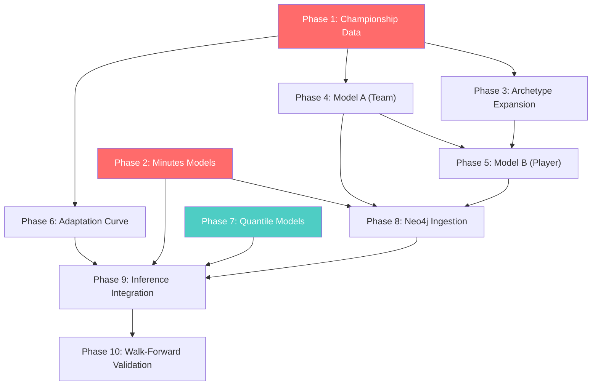

# FPL Promoted Teams — Domain Transfer Implementation Plan

---

## Phase 1: Championship Data Ingestion Pipeline

### Goal
Scrape, clean, and store per-90 player stats and team-level stats from FBref for **all 24 Championship teams across 5+ seasons** (2019-20 through 2025-26). This is the foundational dataset for every downstream phase.

### Dependencies
None (foundational).

### New Files / Modules

| File | Purpose |
|------|---------|
| `ml/data/fbref_scraper.py` | FBref HTML scraper with rate limiting |
| `ml/data/championship_pipeline.py` | Orchestrator: scrape → clean → merge → save |
| `ml/data/championship_player_stats.csv` | Output: player-level per-90 stats |
| `ml/data/championship_team_stats.csv` | Output: team-level aggregate stats |
| `ml/data/transfer_activity.csv` | Output: transfer fees, market values, manager flags |
| `ml/data/__init__.py` | Package init |

### Data Sources

**FBref — Championship (comp ID = 72)**

Player stats pages (one per stat category per season):
```
https://fbref.com/en/comps/72/{season}/stats/{season}-Championship-Stats
https://fbref.com/en/comps/72/{season}/shooting/{season}-Championship-Stats
https://fbref.com/en/comps/72/{season}/passing/{season}-Championship-Stats
https://fbref.com/en/comps/72/{season}/defense/{season}-Championship-Stats
https://fbref.com/en/comps/72/{season}/gca/{season}-Championship-Stats
https://fbref.com/en/comps/72/{season}/possession/{season}-Championship-Stats
https://fbref.com/en/comps/72/{season}/playingtime/{season}-Championship-Stats
https://fbref.com/en/comps/72/{season}/keepers/{season}-Championship-Stats
https://fbref.com/en/comps/72/{season}/keepersadv/{season}-Championship-Stats
```

Where `{season}` = `2019-2020`, `2020-2021`, `2021-2022`, `2022-2023`, `2023-2024`, `2024-2025`, `2025-2026`.

Team-level stats (squad aggregates on same pages — the top table, not per-player):
```
https://fbref.com/en/comps/72/{season}/stats/{season}-Championship-Stats
```

**Transfermarkt** — for market values and transfer fees:
```
https://www.transfermarkt.com/championship/transfers/wettbewerb/GB2/saison_id/{year}
https://www.transfermarkt.com/championship/startseite/wettbewerb/GB2/plus/?saison_id={year}
```

**Manager history** — from Transfermarkt team pages:
```
https://www.transfermarkt.com/{team-slug}/trainer/verein/{club_id}
```

> [!IMPORTANT]
> **Rate limiting**: FBref requires ≥ 3-second delays between requests. Transfermarkt requires ≥ 5 seconds. Implement `time.sleep()` guards and retry with exponential backoff.

### Input Schema
Raw HTML tables from FBref. Executor should use `pandas.read_html()` or `BeautifulSoup` to parse `<table>` elements with `id="stats_standard"`, `id="stats_shooting"`, etc.

### Output Schema

**`championship_player_stats.csv`** — one row per player per season:

| Column | Type | Source |
|--------|------|--------|
| `player_name` | str | FBref |
| `player_fbref_id` | str | FBref URL slug |
| `season` | str | e.g. "2024-25" |
| `team` | str | FBref |
| `position` | str | GK/DEF/MID/FWD (map from FBref pos codes) |
| `age` | int | FBref |
| `minutes_played` | int | FBref |
| `starts` | int | FBref |
| `matches_played` | int | FBref |
| `goals_per90` | float | FBref |
| `assists_per90` | float | FBref |
| `xg_per90` | float | FBref |
| `xa_per90` | float | FBref |
| `xg_plus_xa_per90` | float | FBref |
| `npxg_per90` | float | FBref |
| `shots_per90` | float | FBref |
| `shots_on_target_per90` | float | FBref |
| `key_passes_per90` | float | FBref |
| `pass_completion_pct` | float | FBref |
| `progressive_passes_per90` | float | FBref |
| `progressive_carries_per90` | float | FBref |
| `dribbles_completed_per90` | float | FBref |
| `tackles_per90` | float | FBref |
| `interceptions_per90` | float | FBref |
| `blocks_per90` | float | FBref |
| `aerials_won_per90` | float | FBref |
| `clearances_per90` | float | FBref |
| `gca_per90` | float | FBref (goal-creating actions) |
| `sca_per90` | float | FBref (shot-creating actions) |
| `clean_sheets` | int | FBref (keepers page for GK) |
| `saves_per90` | float | FBref (keepers page) |
| `psxg_minus_ga` | float | FBref (keeper advanced — post-shot xG minus goals allowed) |
| `was_promoted` | bool | Derived: did this team get promoted after this season? |
| `team_finish_position` | int | Derived from final standings |

**`championship_team_stats.csv`** — one row per team per season:

| Column | Type | Source |
|--------|------|--------|
| `team` | str | FBref |
| `season` | str | |
| `matches_played` | int | FBref |
| `wins` | int | FBref |
| `draws` | int | FBref |
| `losses` | int | FBref |
| `points` | int | FBref |
| `finish_position` | int | Derived |
| `xg` | float | FBref |
| `xga` | float | FBref |
| `xgd` | float | Computed: xg - xga |
| `goals_scored` | float | FBref |
| `goals_conceded` | float | FBref |
| `possession_pct` | float | FBref |
| `squad_market_value` | float | Transfermarkt |

**`transfer_activity.csv`** — one row per team per season:

| Column | Type | Source |
|--------|------|--------|
| `team` | str | Transfermarkt |
| `season` | str | |
| `transfer_fee_spent` | float | Transfermarkt (total spend in €M) |
| `transfer_fee_received` | float | Transfermarkt |
| `net_spend` | float | Computed |
| `incoming_players_gk` | int | Transfermarkt |
| `incoming_players_def` | int | Transfermarkt |
| `incoming_players_mid` | int | Transfermarkt |
| `incoming_players_fwd` | int | Transfermarkt |
| `squad_market_value_delta` | float | Computed: current − previous season |
| `manager_change_flag` | bool | Transfermarkt: different manager at end vs start |
| `manager_name` | str | Transfermarkt |

### Feature Engineering
None in this phase — raw data collection only.

### Neo4j Changes
None in this phase.

### Training Integration
None — data collection only.

### Inference Integration
None — data collection only.

### Validation
- Assert ≥ 24 teams per season
- Assert ≥ 400 players per season (Championship squads ≈ 500-600 active players)
- Assert all per-90 columns are non-negative floats
- Assert no season is missing
- Cross-check promoted teams against known history (e.g. 2019-20: Leeds, WBA; 2020-21: Norwich, Watford, Brentford)

### Estimated Data Volume
- **Players**: ~600 per season × 6 seasons = **~3,600 player-season rows**
- **Teams**: 24 per season × 6 seasons = **~144 team-season rows**
- **Transfer activity**: **~144 rows**

### Risks / Decision Points

> [!WARNING]
> **Decision**: FBref blocks aggressive scraping. The executor must decide between:
> 1. Direct scraping with `requests` + `BeautifulSoup` (slow, fragile, but free)
> 2. Using `soccerdata` Python package which wraps FBref (cleaner API, handles rate limiting)
> 3. Manual CSV export from FBref (no code needed, but not automatable)
>
> **Recommendation**: Use `soccerdata` if the dependency is acceptable; otherwise `requests` + `BeautifulSoup` with 5-second delays.

> [!WARNING]
> **Decision**: FBref position codes differ from FPL codes. Mapping required:
> - FBref `GK` → `GK`
> - FBref `DF`, `DF,MF` → `DEF`
> - FBref `MF`, `MF,DF`, `MF,FW` → `MID`
> - FBref `FW`, `FW,MF` → `FWD`
>
> For dual-position players (`MF,FW`), use the **first listed position** or the FPL-registered position if available.

---

## Phase 2: Minutes Models (Model C: P(start), Model D: E[minutes|start])

### Goal
Build two new XGBoost models using **EPL data only** that predict whether a player starts and how many minutes they play if they do start. These are first-class model outputs that feed into the points prediction.

### Dependencies
- Existing EPL training data: [cleaned_merged_seasons.csv](file:///c:/ACL2/FPL/ACL_M3/cleaned_merged_seasons.csv) or the 3-season CSVs
- Existing [feature_engineering.py](file:///c:/ACL2/FPL/ACL_M3/ml/feature_engineering.py)
- Existing start probability model at `ml/models/start_probability_v1_calibrated.pkl` (reference/baseline — will be replaced)

### New Files / Modules

| File | Purpose |
|------|---------|
| `ml/minutes_model.py` | MinutesPredictor class: trains and runs Model C + Model D |
| `ml/models/minutes_pstart_{pos}_v1.pkl` | P(start) model per position (4 files) |
| `ml/models/minutes_eminutes_{pos}_v1.pkl` | E[minutes\|start] model per position (4 files) |
| `ml/models/minutes_pstart_{pos}_v1_mappings.json` | Feature mappings (4 files) |
| `ml/models/minutes_eminutes_{pos}_v1_mappings.json` | Feature mappings (4 files) |

### Data Sources
- Existing EPL CSVs: `FPL_2023_2024.csv`, `FPL_2024_2025.csv`, `FPL_2025_2026.csv`
- Or the merged `cleaned_merged_seasons.csv` (15.7 MB, ~69K+ rows)
- FPL API bootstrap for current-season squad status: `https://fantasy.premierleague.com/api/bootstrap-static/`

### Input Schema

**Model C (P(start))** — binary classification:

| Feature | Source |
|---------|--------|
| `form` | Lagged 4-GW rolling avg of total_points |
| `minutes_rolling5` | Lagged 5-GW rolling avg of minutes |
| `points_per_90` | Lagged |
| `value` | Current price |
| `was_home` | Fixture context |
| `gw_in_season` | GW / 38 |
| `days_since_last_match` | Computed from kickoff_time |
| `fixture_congestion_risk` | From feature_engineering.py |
| `team_def_strength` | Rolling team defensive strength |
| `opp_def_strength` | Rolling opponent defensive strength |
| `fixtures_this_gw` | DGW feature |
| `started_last_match` | Binary: did player start previous GW |
| `started_2_of_last_3` | Binary: started ≥ 2 of last 3 GWs |
| `avg_minutes_last_3` | Mean minutes over last 3 GWs |
| Position one-hot | GK/DEF/MID/FWD |
| Team one-hot | From feature mappings |

**Target for Model C**: `started` = 1 if `minutes >= 60`, else 0 (proxy for starting; FPL data has `starts` column in recent seasons — use it if available, otherwise threshold at 60 min).

**Model D (E[minutes|start])** — regression, trained only on rows where `started = 1`:

Same features as Model C, plus:

| Feature | Source |
|---------|--------|
| `is_dgw` | `fixtures_this_gw >= 2` |

**Target for Model D**: `minutes` (the actual minutes played in that fixture, for rows where started=1).

### Output Schema

**At inference time, for each player:**

```python
{
    "p_start": 0.85,              # Model C output (probability)
    "e_minutes_given_start": 78,   # Model D output (minutes)
    "expected_minutes": 66.3,      # p_start × e_minutes_given_start
}
```

### Feature Engineering
Add to [feature_engineering.py](file:///c:/ACL2/FPL/ACL_M3/ml/feature_engineering.py):
- `started_last_match`: Binary, shift(1) of (`minutes >= 60` or `starts == 1`)
- `started_2_of_last_3`: Rolling sum of started over last 3 GWs, ≥ 2
- `avg_minutes_last_3`: Rolling 3-GW mean of minutes, lagged by 1

### Neo4j Changes
None — uses CSV data.

### Training Integration
- Train 4 × Model C (one per position: `GK`, `DEF`, `MID`, `FWD`)
- Train 4 × Model D (one per position)
- Use same temporal split as existing models (72% train, 8% val, 20% test)
- XGBoost hyperparameters for Model C (classification):
  ```python
  XGBClassifier(
      n_estimators=300,
      learning_rate=0.05,
      max_depth=4,
      subsample=0.8,
      colsample_bytree=0.8,
      eval_metric='logloss',
      early_stopping_rounds=30,
      scale_pos_weight=<compute from class imbalance>
  )
  ```
- XGBoost hyperparameters for Model D (regression):
  ```python
  XGBRegressor(
      n_estimators=300,
      learning_rate=0.05,
      max_depth=4,
      subsample=0.8,
      colsample_bytree=0.8,
      eval_metric='rmse',
      early_stopping_rounds=30
  )
  ```

### Inference Integration
Modify [predictor.py](file:///c:/ACL2/FPL/ACL_M3/ml/predictor.py) `FPLPredictor.predict_next_gameweek()`:

```python
# NEW: Minutes-first prediction pipeline
p_start = minutes_model_c.predict_proba(features)[0][1]
e_minutes = minutes_model_d.predict(features)[0]
expected_minutes = p_start * e_minutes

# Existing points model gives points_per_minute estimate
raw_points = existing_xgb_model.predict(features)[0]
# Scale: raw model was trained to predict total_points for the GW
# Convert to per-minute rate using historical avg minutes for that prediction
points_per_minute = raw_points / 66.5  # League avg minutes for starters

expected_points = expected_minutes * points_per_minute
```

> [!IMPORTANT]
> **Decision point**: The existing XGBoost models predict `total_points` directly, not `points_per_minute`. The executor must decide:
> 1. Keep existing points models as-is and divide their output by expected minutes from training data to get an implicit per-minute rate, OR
> 2. Retrain points models with target = `total_points / minutes * 90` (points-per-90) and then compute `expected_points = expected_minutes / 90 * pp90_prediction`
>
> **Recommendation**: Option 2 is cleaner but requires retraining. Option 1 is faster. Start with Option 1 and schedule Option 2 for a follow-up.

### Validation
- Model C: AUC-ROC ≥ 0.80, calibration curve (Platt scaling already exists at [calibrate_start_probability.py](file:///c:/ACL2/FPL/ACL_M3/ml/calibrate_start_probability.py))
- Model D: RMSE ≤ 12 minutes, MAE ≤ 8 minutes
- Walk-forward: for each GW in test set, predict P(start) and compare against actual starts

### Estimated Data Volume
- Model C training: ~69,000 player-GW rows (all EPL data)
- Model D training: ~45,000 rows (subset where started=1, approximately 65% of total)

### Risks / Decision Points

> [!WARNING]
> **Decision**: How to define "started"? Options:
> 1. Use `starts` column if present in the CSV (available in 2023-24+)
> 2. Threshold: `minutes >= 60` implies started
> 3. Threshold: `minutes >= 45` implies started
>
> **Recommendation**: Use `starts` column where available, fall back to `minutes >= 60`.

> [!CAUTION]
> **Risk**: GK Model D is nearly trivial (GKs who start almost always play 90 min). Expected RMSE for GK Model D will be very low. This is fine — keep it for consistency but expect near-constant predictions.

---

## Phase 3: Archetype Database Expansion

### Goal
Expand the archetype database from 6 manually curated players to **50-100+ historical promoted players** with full Championship per-90 stat embeddings and EPL debut-season actual performance.

### Dependencies
- Phase 1 (Championship data for per-90 stats)
- Existing EPL data (for debut season actuals)

### New Files / Modules

| File | Purpose |
|------|---------|
| `ml/data/build_archetype_database_v2.py` | Automated builder using FBref + EPL data |
| `ml/models/promoted_archetypes_v2.pkl` | Expanded archetype database (replaces v1) |
| `ml/data/promoted_players_master.csv` | Master list of all promoted players 2016-2026 |

### Data Sources
- Phase 1 output: `ml/data/championship_player_stats.csv`
- EPL debut season data: match against `cleaned_merged_seasons.csv` or per-season FPL CSVs
- Promoted team history (hardcoded known list):

| Season | Promoted Teams |
|--------|---------------|
| 2016-17 | Newcastle, Brighton, Huddersfield |
| 2017-18 | Wolverhampton, Cardiff, Fulham |
| 2018-19 | Norwich, Sheffield United, Aston Villa |
| 2019-20 | Leeds, West Brom, Fulham |
| 2020-21 | Norwich, Watford, Brentford |
| 2021-22 | Fulham, Bournemouth, Nottingham Forest |
| 2022-23 | Burnley, Sheffield United, Luton |
| 2023-24 | Leicester, Ipswich, Southampton |
| 2024-25 | Leeds, Burnley, Sunderland (verify actual) |
| 2025-26 | TBD (verify actual) |

### Input Schema
- Championship stats from Phase 1 for the player's **last Championship season before promotion**
- EPL debut season stats from existing FPL CSVs

### Output Schema

**Each archetype entry in `promoted_archetypes_v2.pkl`:**

```python
{
    "player_name": "Ollie Watkins",
    "player_fbref_id": "abc123",
    "position": "FWD",
    "promoted_season": "2020-21",
    "age_at_promotion": 24,
    "team": "Aston Villa",
    "championship_team": "Brentford",
    "team_finish_position": 3,      # Championship finish
    "archetype": "clinical_finisher", # Derived from clustering
    
    # Championship per-90 stats (raw, not scaled)
    "champ_goals_per90": 0.66,
    "champ_assists_per90": 0.18,
    "champ_xg_per90": 0.58,
    "champ_xa_per90": 0.16,
    "champ_shots_per90": 3.68,
    "champ_key_passes_per90": 1.18,
    "champ_tackles_per90": 0.39,
    "champ_interceptions_per90": 0.21,
    "champ_dribbles_completed_per90": 2.24,
    "champ_pass_completion_pct": 68.5,
    "champ_aerials_won_per90": 2.50,
    "champ_progressive_carries_per90": 3.1,
    "champ_sca_per90": 4.2,
    "champ_gca_per90": 0.8,
    
    # EPL debut season actuals
    "epl_goals_per90": 0.38,
    "epl_assists_per90": 0.12,
    "epl_minutes_total": 2800,
    "epl_starts": 31,
    "epl_avg_fpl_points": 4.8,
    "epl_total_fpl_points": 148,
    
    # Per-90 embedding vector (for KNN matching)
    "embedding": np.array([...]),   # 14-dimensional
    
    # Tags for archetype classification
    "tags": ["clinical_finisher", "high_work_rate"]
}
```

### Feature Engineering

**Archetype classification** — k-means clustering on per-90 stat vectors to auto-assign archetypes:

Run k-means (k=8-12) on the per-90 embedding vectors. Label clusters based on centroid characteristics:

| Archetype | Characteristic |
|-----------|---------------|
| `clinical_finisher` | High goals/90, high xG/90, high shots/90 |
| `creative_playmaker` | High assists/90, high key_passes/90, high xA/90 |
| `box_to_box` | Balanced goals + assists + tackles |
| `defensive_anchor` | High tackles/90, high interceptions/90, low goals/90 |
| `ball_carrying_threat` | High dribbles/90, high progressive_carries/90 |
| `target_man` | High aerials_won/90, moderate goals/90 |
| `set_piece_specialist` | High GCA/90 with moderate other stats |
| `ball_playing_defender` | High pass_completion, high progressive_passes/90 |
| `shot_stopper` | High saves/90, high psxg_minus_ga (GK only) |
| `sweeper_keeper` | High pass_completion, moderate saves/90 (GK only) |

### Neo4j Changes
None — archetypes stored in pickle file.

### Training Integration
Archetype DB feeds into Model B (Phase 5) as reference clusters and into the existing [promoted_teams_handler.py](file:///c:/ACL2/FPL/ACL_M3/ml/promoted_teams_handler.py) KNN matcher.

### Inference Integration
Update `PromotedTeamsHandler.__init__()` to load `promoted_archetypes_v2.pkl` instead of `promoted_archetypes.pkl`. Update `find_similar_archetypes()` to use 14-dim embeddings from expanded DB.

### Validation
- Assert ≥ 50 unique players in DB
- Assert all 4 positions represented (≥ 5 GK, ≥ 15 DEF, ≥ 15 MID, ≥ 10 FWD)
- Assert archetype clusters are balanced (no cluster > 30% of total)
- Cross-validate KNN: leave-one-out, predict EPL avg points from k=5 nearest neighbours, check MAE ≤ 1.5 pts/game

### Estimated Data Volume
- **Target**: 80-120 archetype entries
- ~3 promoted teams × 10 seasons × ~4 key players per team = ~120 candidates
- After filtering for ≥ 900 EPL minutes in debut season: ~80-100 usable

### Risks / Decision Points

> [!WARNING]
> **Decision**: How many k-means clusters for archetype labeling?
> - Too few (k=4): archetypes too coarse, segmented translation loses granularity
> - Too many (k=15): clusters too small for reliable translation statistics
>
> **Recommendation**: Start with k=8. Evaluate silhouette score. Adjust if any cluster has < 5 members.

> [!WARNING]
> **Decision**: Minimum EPL debut-season minutes threshold to include a player as an archetype?
> - 450 minutes (≥ 5 full games): more players but noisier debut stats
> - 900 minutes (≥ 10 full games): fewer players but more reliable
>
> **Recommendation**: 900 minutes. Players with < 900 EPL minutes likely didn't get consistent opportunities, making their debut stats unreliable as targets.

---

## Phase 4: Model A — Team Strength Translation

### Goal
Train a regression model that translates **Championship team aggregate stats into EPL-equivalent team strength metrics**. This produces the `translated_team_strength` features that feed into Model B.

### Dependencies
- Phase 1 (Championship team stats)
- EPL team stats for promoted teams' debut seasons (from existing data)

### New Files / Modules

| File | Purpose |
|------|---------|
| `ml/translation/model_a_team.py` | Model A training and inference |
| `ml/models/translation_model_a_v1.pkl` | Trained Model A (XGBoost) |
| `ml/models/translation_model_a_v1_mappings.json` | Feature mappings |
| `ml/translation/__init__.py` | Package init |

### Data Sources
- Phase 1 output: `ml/data/championship_team_stats.csv`
- EPL team-level stats for promoted teams' first EPL season: derive from existing FPL CSVs by aggregating team-level goals, clean sheets, xG from FBref EPL pages:
  ```
  https://fbref.com/en/comps/9/{season}/stats/{season}-Premier-League-Stats
  ```
- Phase 1 output: `ml/data/transfer_activity.csv`

### Input Schema

**Training rows** — one row per promoted team (their last Championship season → first EPL season):

| Feature | Source | Type |
|---------|--------|------|
| `champ_xg` | Championship team stats | float |
| `champ_xga` | Championship team stats | float |
| `champ_xgd` | Computed: xg - xga | float |
| `champ_possession_pct` | Championship team stats | float |
| `champ_points` | Championship team stats | int |
| `champ_finish_position` | Championship team stats | int |
| `champ_market_value` | Transfermarkt | float |
| `transfer_fee_spent` | Transfer activity | float |
| `net_spend` | Transfer activity | float |
| `squad_market_value_delta` | Transfer activity | float |
| `manager_change_flag` | Transfer activity | bool |
| `season_year` | Ordinal encoding (2016=0, 2017=1, ...) | int |

### Output Schema (Targets)

| Target | Source | Description |
|--------|--------|-------------|
| `epl_attack_strength` | EPL debut season xG / 38 | Goals-per-game attack proxy |
| `epl_defensive_strength` | EPL debut season xGA / 38 | Goals-conceded-per-game proxy |
| `epl_team_points_per_game` | EPL debut season points / 38 | Overall strength |

**Training set size**: ~30 promoted teams (3 per season × 10 seasons). This is small.

### Feature Engineering
- `champ_xgd` = `champ_xg` - `champ_xga`
- `season_year` = ordinal encoding
- `spend_per_point` = `transfer_fee_spent` / `champ_points`

### Neo4j Changes
None — model stored as pickle.

### Training Integration

> [!CAUTION]
> **Critical**: With only ~30 training rows, a full XGBoost model will overfit. Options:
> 1. **XGBoost with aggressive regularization**: `max_depth=2`, `n_estimators=50`, `learning_rate=0.1`, `min_child_weight=5`
> 2. **Ridge regression**: More appropriate for small datasets
> 3. **Bayesian linear regression**: Provides uncertainty estimates naturally
>
> **Recommendation**: Train both XGBoost (regularized) and Ridge regression. Use leave-one-out cross-validation (LOOCV) to select the better model. Flag which was chosen.

Train a **multi-output** model (or 3 separate models) predicting the three targets simultaneously.

```python
# Pseudocode
from xgboost import XGBRegressor

model_a = XGBRegressor(
    n_estimators=50,
    max_depth=2,
    learning_rate=0.1,
    min_child_weight=5,
    subsample=0.8,
    reg_alpha=1.0,   # L1 regularization
    reg_lambda=5.0,   # L2 regularization
)
```

### Inference Integration
At inference time (pre-season, when promoted teams are known):

```python
# Given: 2026-27 promoted team's Championship stats
champ_stats = get_championship_team_stats("Sunderland", "2025-26")
transfer_info = get_transfer_activity("Sunderland", "2025-26")

# Predict EPL-equivalent strengths
translated = model_a.predict(combine(champ_stats, transfer_info))
# → {"epl_attack_strength": 1.12, "epl_defensive_strength": 1.45, "epl_team_points_per_game": 1.05}
```

These outputs are stored and passed to Model B for every player on that team.

### Validation
- LOOCV MAE for `epl_team_points_per_game` ≤ 0.25 (≈ 10 points over season)
- LOOCV MAE for `epl_attack_strength` ≤ 0.20
- LOOCV MAE for `epl_defensive_strength` ≤ 0.25
- Sanity check: predicted strengths should be in bottom-half of EPL table range

### Estimated Data Volume
- **Training**: ~30 rows (3 promoted teams × 10 seasons)
- **Features**: 12 columns
- **Targets**: 3 columns

### Risks / Decision Points

> [!CAUTION]
> **Risk**: 30 training rows is very small. Model A may have high variance. Mitigation:
> 1. Use LOOCV (not train/test split)
> 2. Regularize aggressively
> 3. Consider ensembling XGBoost + Ridge for robustness
> 4. Report confidence intervals on predictions

> [!WARNING]
> **Decision**: Should playoff-promoted teams be treated differently from automatic promotion (1st/2nd)? Historically, playoff teams (3rd-6th) perform worse in EPL. Options:
> 1. Add `promotion_route` feature (auto=1, playoff=0)
> 2. No distinction
>
> **Recommendation**: Add `promotion_route` as a feature. It's free information.

---

## Phase 5: Model B — Player Per-90 Translation

### Goal
Train a model that translates **Championship player per-90 stats into EPL-equivalent per-90 stats**, segmented by position, age band, archetype, team finish position, and season year. This replaces the flat scalar multipliers.

### Dependencies
- Phase 1 (Championship player stats)
- Phase 3 (Archetype database — provides archetype labels and EPL debut actuals)
- Phase 4 (Model A — provides team strength context)

### New Files / Modules

| File | Purpose |
|------|---------|
| `ml/translation/model_b_player.py` | Model B training and inference |
| `ml/models/translation_model_b_{pos}_v1.pkl` | Trained Model B per position (4 files) |
| `ml/models/translation_model_b_{pos}_v1_mappings.json` | Feature mappings (4 files) |

### Data Sources
- Phase 1 output: `ml/data/championship_player_stats.csv` (Championship per-90s)
- Phase 3 output: `ml/models/promoted_archetypes_v2.pkl` (EPL debut actuals + archetypes)
- Phase 4 output: `ml/models/translation_model_a_v1.pkl` (team strength predictions)

### Input Schema

**Training rows** — one row per promoted player who played ≥ 900 EPL debut minutes:

| Feature | Source | Type |
|---------|--------|------|
| `champ_goals_per90` | Phase 1 | float |
| `champ_assists_per90` | Phase 1 | float |
| `champ_xg_per90` | Phase 1 | float |
| `champ_xa_per90` | Phase 1 | float |
| `champ_shots_per90` | Phase 1 | float |
| `champ_key_passes_per90` | Phase 1 | float |
| `champ_tackles_per90` | Phase 1 | float |
| `champ_interceptions_per90` | Phase 1 | float |
| `champ_dribbles_completed_per90` | Phase 1 | float |
| `champ_pass_completion_pct` | Phase 1 | float |
| `champ_aerials_won_per90` | Phase 1 | float |
| `champ_progressive_carries_per90` | Phase 1 | float |
| `champ_sca_per90` | Phase 1 | float |
| `champ_gca_per90` | Phase 1 | float |
| `age` | Phase 1 | int |
| `age_band` | Derived: U21, 21-25, 26-29, 30+ | categorical |
| `position` | Phase 1 | categorical (one-hot) |
| `archetype` | Phase 3 (k-means label) | categorical (one-hot) |
| `team_finish_position` | Phase 1 | int |
| `season_year` | Ordinal | int |
| `translated_attack_strength` | Phase 4 Model A output | float |
| `translated_defensive_strength` | Phase 4 Model A output | float |
| `translated_team_ppg` | Phase 4 Model A output | float |
| `transfer_fee_spent` | Phase 1 transfer data | float |
| `manager_change_flag` | Phase 1 transfer data | bool |

### Output Schema (Targets)

**Multi-output regression** — one model per position, predicting EPL per-90 equivalents:

| Target (FWD/MID) | Source |
|-------------------|--------|
| `epl_goals_per90` | EPL debut actuals from archetype DB |
| `epl_assists_per90` | EPL debut actuals |
| `epl_xg_per90` | EPL debut actuals (from FBref EPL) |
| `epl_xa_per90` | EPL debut actuals |
| `epl_shots_per90` | EPL debut actuals |
| `epl_key_passes_per90` | EPL debut actuals |

| Target (DEF) | Source |
|--------------|--------|
| `epl_clean_sheets_per90` | EPL debut actuals |
| `epl_tackles_per90` | EPL debut actuals |
| `epl_interceptions_per90` | EPL debut actuals |
| `epl_goals_per90` | EPL debut actuals |

| Target (GK) | Source |
|-------------|--------|
| `epl_saves_per90` | EPL debut actuals |
| `epl_clean_sheets_per90` | EPL debut actuals |
| `epl_psxg_minus_ga` | EPL debut actuals |

### Feature Engineering

- `age_band`: Bucket `age` into `['U21', '21-25', '26-29', '30+']`
- `archetype`: From Phase 3 k-means clustering
- All segmentation dimensions are included as features rather than training separate sub-models (more data-efficient given ~80-100 training rows)

### Neo4j Changes
None.

### Training Integration

> [!IMPORTANT]
> **Key design decision**: With ~80-100 training rows total and only ~20-30 per position, individual per-position models will be fragile. Two options:
>
> 1. **Single model with position as a feature** (more data, but less position-specific)
> 2. **Per-position models** (consistent with existing architecture, but very small training sets)
>
> **Recommendation**: Train a **single model with position one-hot encoded** for the shared features (tackles, passes, etc.) but train **separate target heads** for position-specific outputs. Concretely: use `sklearn.multioutput.MultiOutputRegressor` wrapping XGBoost, with position as input feature.
>
> For per-position targets that only apply to that position (e.g., saves_per90 for GK), train a separate small model on the ~5-10 GK rows using Ridge regression.

```python
XGBRegressor(
    n_estimators=100,
    max_depth=3,
    learning_rate=0.05,
    min_child_weight=3,
    subsample=0.8,
    reg_alpha=1.0,
    reg_lambda=5.0,
)
```

### Inference Integration

Modify [promoted_teams_handler.py](file:///c:/ACL2/FPL/ACL_M3/ml/promoted_teams_handler.py) `scale_championship_stats()` to replace flat scalars:

```python
# OLD (flat scalar — to be removed):
# scaled_data['goals_scored'] = original * 0.70

# NEW (Model B translation):
champ_per90 = extract_per90_features(player_data)
team_strength = model_a.predict(team_data)  # From Phase 4
translated_per90 = model_b.predict(
    combine(champ_per90, age, position, archetype, team_strength)
)
```

### Validation
- LOOCV on archetype DB: predict EPL per-90s from Championship per-90s
- MAE for `epl_goals_per90` ≤ 0.15 (for FWD)
- MAE for `epl_assists_per90` ≤ 0.10
- Compare against flat-scalar baseline: Model B should reduce MAE by ≥ 15%
- Sanity: translated per-90 values should be lower than Championship per-90 for attacking stats

### Estimated Data Volume
- **Training**: ~80-100 player rows (from expanded archetype DB)
- **Per position**: GK ~8-12, DEF ~25-30, MID ~30-35, FWD ~15-20
- **Features**: ~28 columns
- **Targets**: 4-6 columns (position-dependent)

### Risks / Decision Points

> [!CAUTION]
> **Risk**: This is the most data-constrained model in the system. 80-100 rows for a multi-output regression is challenging. Mitigations:
> 1. Use Ridge regression as a fallback for positions with < 15 training rows
> 2. Apply strong regularization
> 3. Report LOOCV confidence intervals
> 4. For GK specifically (< 12 rows), consider using the flat scalar as a fallback with a logged warning

> [!WARNING]
> **Decision**: Should Model B predict EPL per-90 stats directly, or predict the **ratio** (EPL / Championship) which is then applied as a learned scalar?
>
> - **Direct prediction**: Simpler, but ignores the Championship baseline (a player with 0.2 goals/90 and one with 0.8 goals/90 in Championship get treated the same if features are similar)
> - **Ratio prediction**: Preserves relative differences from Championship, but ratios can be unstable for small denominators
>
> **Recommendation**: Predict **direct EPL per-90 values** but include the Championship per-90 values as input features. This lets the model learn the mapping while preserving the Championship signal.

---

## Phase 6: Adaptation Curve Features

### Goal
Add gameweek-level features that capture promoted players' adaptation trajectory during their debut EPL season. Evaluate whether XGBoost can learn the interaction or whether manual curve engineering is needed.

### Dependencies
- Phase 1 (Championship data identifies promoted players)
- Existing EPL data (for historical promoted player GW-level performance)

### New Files / Modules

| File | Purpose |
|------|---------|
| `ml/features/adaptation_curve.py` | Adaptation feature builder + evaluation |

### Data Sources
- Existing EPL CSVs: filter to players on promoted teams
- Phase 1: `was_promoted` flag from `championship_player_stats.csv`

### Input Schema
Existing player-GW rows from EPL data, filtered to promoted-team players.

### Output Schema
New features added to the feature engineering pipeline:

| Feature | Type | Description |
|---------|------|-------------|
| `gw_number` | int | Gameweek number (1-38) |
| `weeks_since_season_start` | float | Calendar weeks from GW1 kickoff |
| `is_promoted_player` | bool | Player's team was promoted this season |
| `promoted_gw_interaction` | float | `is_promoted_player × gw_number` (interaction term) |

### Feature Engineering
Add to [feature_engineering.py](file:///c:/ACL2/FPL/ACL_M3/ml/feature_engineering.py):

```python
def _add_adaptation_features(self, df: pd.DataFrame) -> pd.DataFrame:
    df['is_promoted_player'] = df['team'].isin(PROMOTED_TEAMS_BY_SEASON.get(season, []))
    df['gw_number'] = df['GW']
    df['weeks_since_season_start'] = (
        df['kickoff_time'] - df.groupby('season_x')['kickoff_time'].transform('min')
    ).dt.days / 7.0
    df['promoted_gw_interaction'] = df['is_promoted_player'].astype(int) * df['gw_number']
    return df
```

### Neo4j Changes
None.

### Training Integration
These features are added to the **existing GK/DEF/MID/FWD XGBoost models** as additional input columns. No new model needed — XGBoost learns the interaction.

**Critical evaluation**: After adding these features, compare:
1. XGBoost with `promoted_gw_interaction` feature (let the model learn the curve)
2. Manual decay: `adaptation_weight = min(1.0, gw_number / 12)` applied as a feature

Run both on the test set and report R² improvement. If XGBoost interaction provides ≤ 0.005 R² improvement over manual, use manual (more interpretable, more reliable with sparse data).

### Inference Integration
Features are computed during `engineer_features()` and passed to existing models. No separate inference step.

### Validation
- Filter test set to promoted-team players only
- Compare RMSE with and without adaptation features for this subset
- **Expected**: ~3,000 promoted-player rows across 5+ seasons in the test window. Run paired t-test on per-GW RMSE.

### Estimated Data Volume
- ~3,000 promoted-player-GW rows across training data (10 seasons × 3 teams × ~15 key players × ~25 GWs with minutes)
- This is sparse relative to the ~69,000 total EPL rows

### Risks / Decision Points

> [!CAUTION]
> **Decision**: XGBoost interaction vs. manual curve.
>
> Given ~3,000 "promoted player × early GW" rows, XGBoost may not have enough signal to learn a meaningful interaction, especially after the temporal split reduces this to ~2,000 training rows. If the interaction feature shows < 0.005 R² improvement in a controlled experiment (same model, only difference is this feature), default to the manual curve.
>
> **Recommendation**: Implement both, evaluate, log which was chosen with rationale.

---

## Phase 7: Quantile Regression Models

### Goal
Train P10, P50, P90 XGBoost models per position to produce 80% prediction intervals alongside point estimates. Output: `{ expected_pts: 145, interval_80: [90, 190] }`.

### Dependencies
- Existing trained XGBoost models (GK/DEF/MID/FWD)
- Existing training data and feature pipeline

### New Files / Modules

| File | Purpose |
|------|---------|
| `ml/quantile_models.py` | QuantilePredictor class |
| `ml/models/xgboost_{pos}_q10_v1.pkl` | P10 model per position (4 files) |
| `ml/models/xgboost_{pos}_q50_v1.pkl` | P50 model per position (4 files) |
| `ml/models/xgboost_{pos}_q90_v1.pkl` | P90 model per position (4 files) |

### Data Sources
- Same EPL training data as existing models

### Input Schema
Same feature set as existing XGBoost models (no new features).

### Output Schema

```python
{
    "expected_pts": 5.2,         # P50 prediction
    "interval_80": [2.1, 8.4],   # [P10, P90]
    "prediction_spread": 6.3     # P90 - P10 (uncertainty width)
}
```

For season-level aggregation:
```python
{
    "expected_pts": 145,
    "interval_80": [90, 190]
}
```

### Feature Engineering
None — uses existing features.

### Neo4j Changes
None.

### Training Integration
Train 3 models per position (12 total) using XGBoost quantile regression:

```python
# P10 model
XGBRegressor(
    objective='reg:quantileerror',
    quantile_alpha=0.10,
    n_estimators=500,
    learning_rate=0.05,
    max_depth=5,
    subsample=0.8,
    colsample_bytree=0.8,
    early_stopping_rounds=50,
)

# P50 model
XGBRegressor(
    objective='reg:quantileerror',
    quantile_alpha=0.50,
    # ... same hyperparameters
)

# P90 model
XGBRegressor(
    objective='reg:quantileerror',
    quantile_alpha=0.90,
    # ... same hyperparameters
)
```

Use identical temporal split and feature engineering as existing models.

### Inference Integration
Modify [predictor.py](file:///c:/ACL2/FPL/ACL_M3/ml/predictor.py) to optionally return quantile predictions:

```python
# In FPLPredictor.predict_next_gameweek():
prediction = self.model.predict(features)[0]
p10 = self.quantile_models['p10'].predict(features)[0]
p90 = self.quantile_models['p90'].predict(features)[0]

return PlayerPrediction(
    predicted_points=prediction,
    confidence_interval=(max(0, p10), p90),
)
```

Update [PredictionResponse](file:///c:/ACL2/FPL/ACL_M3/ml/api_integration.py#L39-L47) to include the interval:

```python
class PredictionResponse(BaseModel):
    player_name: str
    predicted_points: float
    confidence_interval: Optional[List[float]] = None  # [p10, p90]
    prediction_spread: Optional[float] = None           # p90 - p10
    # ... existing fields
```

### Validation
- **Calibration check**: On test set, verify that ~80% of actual values fall within [P10, P90]
- If calibration < 75% or > 85%, adjust quantile alphas (e.g., 0.08/0.92 instead of 0.10/0.90)
- **Crossing check**: Verify P10 ≤ P50 ≤ P90 for all predictions (quantile crossing is possible with independent models — post-hoc sort if needed)

### Estimated Data Volume
- Same as existing models: ~69,000 player-GW rows
- 12 new models to train (4 positions × 3 quantiles)

### Risks / Decision Points

> [!WARNING]
> **Decision**: XGBoost's `reg:quantileerror` objective was added in XGBoost 2.0. Verify the installed version supports it. If not, alternatives:
> 1. Upgrade XGBoost to ≥ 2.0
> 2. Use `objective='reg:pseudohubererror'` as an approximation
> 3. Use LightGBM's quantile regression
>
> **Recommendation**: Upgrade XGBoost. Check `requirements.txt` for current version constraint.

> [!NOTE]
> **Note**: Quantile crossing (P10 > P50 or P50 > P90) can occur because models are trained independently. Apply post-hoc sorting: `p10, p50, p90 = sorted([p10_raw, p50_raw, p90_raw])`.

---

## Phase 8: Neo4j Promoted Player Ingestion

### Goal
Design and implement the data ingestion path for promoted players entering Neo4j with **zero EPL history**. Create the nodes, relationships, and translated stats so that the existing prediction pipeline can query them.

### Dependencies
- Phase 4 (Model A — team strength translation)
- Phase 5 (Model B — player per-90 translation)
- Phase 2 (Minutes models — for P(start) estimates)
- Existing Neo4j schema (Player, Team, Fixture, Gameweek, Season, Position nodes)

### New Files / Modules

| File | Purpose |
|------|---------|
| `ml/data/ingest_promoted_players.py` | Neo4j ingestion script for promoted players |
| `scripts/preseason_promoted_setup.py` | One-time pre-season setup script |

### Data Sources
- Phase 1: Championship player stats
- Phase 4: Model A team translations
- Phase 5: Model B player translations
- FPL API: `https://fantasy.premierleague.com/api/bootstrap-static/` — for player IDs, prices, positions in the new season
- FPL API element summary: `https://fantasy.premierleague.com/api/element-summary/{id}/` — for historical data if player previously played EPL

### Input Schema
From FPL API bootstrap (filtered to promoted teams):

| Field | Source |
|-------|--------|
| `id` | FPL API |
| `web_name` | FPL API |
| `first_name` | FPL API |
| `second_name` | FPL API |
| `team` | FPL API (team ID → team name mapping) |
| `element_type` | FPL API (1=GK, 2=DEF, 3=MID, 4=FWD) |
| `now_cost` | FPL API (price × 10) |
| `chance_of_playing_next_round` | FPL API |
| `news` | FPL API |

### Output Schema (Neo4j nodes/relationships)

**New nodes for promoted teams:**

```cypher
// Team node (may already exist if team was previously in EPL)
MERGE (t:Team {name: $team_name})
SET t.is_promoted_2026_27 = true,
    t.translated_attack_strength = $attack_strength,
    t.translated_defensive_strength = $def_strength,
    t.translated_team_ppg = $team_ppg

// Player node
MERGE (p:Player {name: $full_name})
SET p.fpl_id = $fpl_id,
    p.is_promoted = true,
    p.championship_team = $champ_team,
    p.age = $age

// Position relationship
MERGE (pos:Position {code: $position_code})
MERGE (p)-[:PLAYS_POSITION]->(pos)

// Team relationship
MERGE (p)-[:PLAYS_FOR]->(t)

// Synthetic PLAYED_IN relationships with translated stats
// These are Model B outputs, stored as if they were historical EPL performances
// Flagged with `is_synthetic = true` so the system knows they're translations
CREATE (p)-[r:PLAYED_IN {
    is_synthetic: true,
    source: 'championship_translation_v1',
    total_points: $translated_avg_points,
    minutes: $translated_avg_minutes,
    goals_scored: $translated_goals,
    assists: $translated_assists,
    clean_sheets: $translated_cs,
    bonus: $translated_bonus,
    bps: $translated_bps,
    ict_index: $translated_ict,
    influence: $translated_influence,
    creativity: $translated_creativity,
    threat: $translated_threat,
    value: $fpl_price,
    was_home: 0,
    saves: $translated_saves
}]->(f:Fixture)
```

> [!IMPORTANT]
> **Key design decision**: Should synthetic `PLAYED_IN` relationships point to real fixture nodes or synthetic fixtures?
>
> **Recommendation**: Create **4 synthetic fixture nodes** (one per "synthetic GW") per promoted team. These are flagged `is_synthetic: true` and linked to a synthetic gameweek. The prediction pipeline queries the last 4 `PLAYED_IN` relationships — if they're synthetic, the feature engineering still works.
>
> ```cypher
> CREATE (f:Fixture {
>     id: "synthetic_promoted_{team}_{n}",
>     is_synthetic: true,
>     season_id: "2026-27",
>     kickoff_time: datetime("2026-07-01T00:00:00Z")  // Pre-season date
> })
> ```

### Feature Engineering
None — this phase populates the data that existing feature engineering consumes.

### Neo4j Changes
1. Add `is_promoted` property to `Player` nodes
2. Add `is_promoted_2026_27` property to `Team` nodes
3. Add `translated_attack_strength`, `translated_defensive_strength`, `translated_team_ppg` to promoted `Team` nodes
4. Add `is_synthetic` property to synthetic `PLAYED_IN` relationships and `Fixture` nodes
5. Create 4 synthetic `PLAYED_IN` relationships per promoted player with translated stats

### Training Integration
None — this is a data population step.

### Inference Integration
The existing [api_integration.py](file:///c:/ACL2/FPL/ACL_M3/ml/api_integration.py) queries (`get_player_data_for_prediction`, `predict_top_performers`) already fetch the last 4 `PLAYED_IN` relationships. Synthetic relationships will be returned by these queries. The prediction pipeline treats them as normal stats.

**One modification needed**: In the top-performers query in [api_integration.py](file:///c:/ACL2/FPL/ACL_M3/ml/api_integration.py#L392-L428), the `WHERE r.minutes > 0` clause will correctly include synthetic rows (they have translated minutes > 0). The `WHERE fixture_count > 0` clause will include promoted teams because they have 2026-27 fixtures.

### Validation
- After ingestion, verify all promoted team players appear in `/api/ml/predict/top-performers`
- Verify synthetic PLAYED_IN stats produce reasonable predictions (within 2-6 pts range)
- Count: expect ~25-30 players per promoted team × 3 teams = ~75-90 promoted players in Neo4j

### Estimated Data Volume
- ~75-90 new Player nodes (some may already exist)
- ~3 new or updated Team nodes
- ~300-360 synthetic PLAYED_IN relationships (4 per player)
- ~12 synthetic Fixture nodes (4 per team)

### Risks / Decision Points

> [!CAUTION]
> **Risk**: Synthetic PLAYED_IN relationships could contaminate feature engineering if not handled carefully. The `form` feature computes a rolling average of `total_points` — if all 4 synthetic rows have the same translated value, form will be flat/constant. This is acceptable for GW1 but should be replaced with real data ASAP.
>
> **Mitigation**: After each real GW, run a script that deletes the oldest synthetic PLAYED_IN and keeps the rest. By GW 4, all synthetic relationships are gone.

> [!WARNING]
> **Decision**: Name matching between FBref and FPL API. Player names differ between sources (e.g., "João Pedro" vs "J.Pedro"). Options:
> 1. Manual mapping CSV for the ~90 promoted players (one-time effort)
> 2. Fuzzy matching with `fuzzywuzzy` using team as a constraint
> 3. Match on FBref player ID → Transfermarkt ID → FPL ID chain
>
> **Recommendation**: Fuzzy matching constrained by team, with a manual override CSV for ambiguous cases.

---

## Phase 9: Inference Pipeline Integration

### Goal
Wire all new models (A, B, C, D, quantile) into the existing prediction pipeline so that promoted players get full predictions through the standard API endpoints.

### Dependencies
- All previous phases

### New Files / Modules

| File | Purpose |
|------|---------|
| `ml/promoted_teams_handler_v2.py` | Rewritten handler using Models A-D + quantile |
| `ml/translation/inference.py` | Translation inference pipeline |

### Modifications to Existing Files

| File | Change |
|------|--------|
| [predictor.py](file:///c:/ACL2/FPL/ACL_M3/ml/predictor.py) | Add minutes model loading, quantile model loading, minutes-first prediction |
| [api_integration.py](file:///c:/ACL2/FPL/ACL_M3/ml/api_integration.py) | Add `confidence_interval` to responses, load new models |
| [feature_engineering.py](file:///c:/ACL2/FPL/ACL_M3/ml/feature_engineering.py) | Add adaptation features from Phase 6 |
| [api_main.py](file:///c:/ACL2/FPL/ACL_M3/api_main.py) | Load new models on startup |

### Inference Flow (Updated)

```
┌─────────────────────────────────────────────────────────────┐
│                    API Request Received                       │
│                  (player_name, fixture)                       │
└─────────────────────┬───────────────────────────────────────┘
                      │
                      ▼
              ┌───────────────┐
              │ Is promoted?  │
              └──┬─────────┬──┘
                 │ YES     │ NO
                 ▼         ▼
        ┌────────────┐  ┌──────────────────┐
        │ Fetch from │  │ Standard Neo4j   │
        │ Neo4j      │  │ query (existing) │
        │ (synthetic │  │                  │
        │  PLAYED_IN)│  │                  │
        └─────┬──────┘  └────────┬─────────┘
              │                   │
              ▼                   ▼
      ┌───────────────────────────────────┐
      │     Feature Engineering            │
      │  (includes adaptation features)    │
      └────────────────┬──────────────────┘
                       │
                       ▼
              ┌────────────────┐
              │ Model C:       │
              │ P(start)       │
              └───────┬────────┘
                      │
                      ▼
              ┌────────────────┐
              │ Model D:       │
              │ E[min|start]   │
              └───────┬────────┘
                      │
                      ▼
              ┌────────────────────┐
              │ expected_minutes = │
              │ p_start × e_min   │
              └───────┬────────────┘
                      │
                      ▼
        ┌─────────────────────────────┐
        │ Position-specific XGBoost   │
        │ (GK/DEF/MID/FWD)           │
        │ → points prediction        │
        └─────────────┬───────────────┘
                      │
                      ▼
        ┌─────────────────────────────┐
        │ Quantile models (P10/P90)  │
        │ → confidence interval      │
        └─────────────┬───────────────┘
                      │
                      ▼
        ┌─────────────────────────────┐
        │ Combine:                    │
        │ expected_pts =              │
        │   expected_min × pts/min   │
        │ interval_80 = [P10, P90]   │
        └─────────────┬───────────────┘
                      │
                      ▼
              ┌──────────────┐
              │ Cache + Return│
              └──────────────┘
```

### Validation
- End-to-end test: call `/api/ml/predict/player` for a promoted player, verify response includes `confidence_interval`
- End-to-end test: call `/api/ml/predict/top-performers`, verify promoted players appear in results
- Compare promoted player predictions against position-average baselines — should be within ±30%

### Estimated Data Volume
N/A — inference pipeline.

### Risks / Decision Points

> [!WARNING]
> **Decision**: Model loading order on startup. All models must load before serving requests. Current startup in [api_main.py](file:///c:/ACL2/FPL/ACL_M3/api_main.py) loads 4 XGBoost models. Now need to load 4 + 8 (minutes) + 12 (quantile) + 1 (Model A) + 4 (Model B) = **29 models**. Memory impact: ~29 × 1MB ≈ 30MB. Acceptable.
>
> **Recommendation**: Load all models in parallel using `asyncio.gather` on startup. Log each model load with timing.

---

## Phase 10: Walk-Forward Validation

### Goal
Validate the complete system (translation + minutes + points + quantile) against historical promoted teams using walk-forward backtesting.

### Dependencies
- All previous phases

### New Files / Modules

| File | Purpose |
|------|---------|
| `ml/validation/walk_forward_promoted.py` | Walk-forward validator for promoted teams |
| `ml/validation/results/` | Directory for validation result CSVs |

### Validation Strategy

For each historical season (2019-20 through 2025-26):
1. **Hold out** that season's promoted teams from all training data
2. **Train** Models A, B on remaining seasons' promoted teams
3. **Translate** held-out Championship stats → EPL equivalents
4. **Predict** GW-by-GW using translated stats (GW 1-6: pure translation; GW 7-12: blended; GW 13+: real data)
5. **Compare** predictions against actual EPL performance

### Metrics

| Metric | Target |
|--------|--------|
| Top-10 hit rate (promoted players in actual top 10 of their position) | ≥ 20% |
| Rank correlation (Spearman's ρ) for promoted players | ≥ 0.40 |
| Points capture rate (predicted top performers vs optimal) | ≥ 60% |
| Quantile calibration (% of actuals within P10-P90) | 75-85% |
| RMSE for promoted players (GW 1-6) | ≤ 3.0 pts |
| RMSE for promoted players (GW 7-12) | ≤ 2.5 pts |
| RMSE for promoted players (GW 13+) | ≤ 2.0 pts |
| Minutes model: P(start) AUC for promoted players | ≥ 0.72 |
| Model A team strength MAE | ≤ 0.25 ppg |
| Model B translation MAE improvement over flat scalar | ≥ 15% |

### Estimated Data Volume
- ~30 promoted teams × ~15 key players × ~25 GWs = ~11,250 prediction-actual pairs
- Each LOOCV fold holds out 1 season (3 teams)

### Risks / Decision Points

> [!CAUTION]
> **Risk**: Walk-forward for Model A/B uses LOOCV with only ~30 total teams. Each fold has only ~27 training teams. Results will have high variance. Report confidence intervals alongside point metrics.

---

## Implementation Priority Summary



**Parallel tracks**:
- Track A (Championship): Phase 1 → 3 → 4 → 5 → 8
- Track B (EPL-only): Phase 2, Phase 6, Phase 7 (all independent)
- Convergence: Phase 9 (requires both tracks)
- Final: Phase 10

DONE
